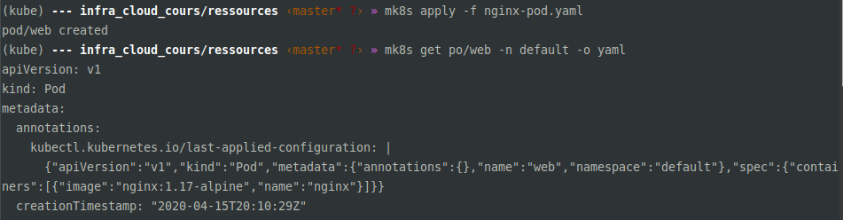

# Notes taken from LinkedIn Learning
Les notes ont été prises depuis [le cours "L'essentiel de Kubernetes".](https://www.linkedin.com/learning/l-essentiel-de-kubernetes/configurer-le-cluster-on-premise?originalSubdomain=fr)

## Table des matières  

* Introduction aux conteneurs
* Docker ? C'est quoi ?
* Intro historique & commerciale de kubernetes
* Intro fonctionnelle de kubernetes
* Architecture générale de kubernetes
* Les différents composants de Kubernetes  
* Les ressources Kubernetes
* Définir des ressources Kubernetes
* Solutions pour déployer et installer un cluster Kubernetes 
* La Pratique avec un cluster single-node locale 
* La pratique avec un cluster on-premise
  - Pré-requis réseaux d'un Noeud Master 
  - Pré-requis réseaux d'un Noeud Worker
  - Installation de kubeadm et télécharger les images
  - Installer le cluster avec kubeadm 
* Le "Context" Kubernetes
* Le "Pod" Kubernetes 
* Pour les motivés et ceux qui veulent aller plus loin dans Kubernetes  
  
## Introduction aux conteneurs

Arrivés avec l'ascenscion du dévelopement de micro-services, avec des cycles de mise en production court et  
avec une tendance scale out plutôt que scale up, les conteneurs deviennent incontournables.  
Il permet de lancer plusieurs services isolés les uns des autres sur un même host.  
  
**Les conteneurs sont arrivés avec :**  
- **FreeBSD jails**  
- **Solaris Zones**  
- **AIX WPARs**  
- **LXC** (linuxcontainer)  
- **Docker** (s'est imposé grâce à sa solution enterprise et le support qu'il a donc apporté aux entreprises)
- **OCI** (open container initiative, fait partie de la LinuxFoundation et porté par Docker et d'autres leaders de   
la conteneurisation.) 

On retrouve dans l'OCI des specificationss comme le runtime spec, qui spécifie le runtime qui permet d'exectuer  
le conteneur. Ou encore l'image spec, qui spécifie comment doit être composé une image de type conteneur.

## Docker ? c'est quoi ?

Docker c'est le leader mondial en terme de conteneurisation. Il est aussi le runtime par défaut utilisé par  
Kubernetes, lui aussi qui s'impose comme un leader mais dans l'orchestration de conteneur. Docker s'execute  
sous la forme d'un service/daemon appelé le docker engine. Et donc la machine qui execute du docker s'appelle  
un docker host. Cet host va executer des conteneurs qui sont des instances d'execution d'images qu'on récuperera  
depuis des registry. Pour accéder à l'engine on utilise la docker cli (sous windows interface web).  
L'image est un ensemble de layers, fourni par un éditeur ou vous-même.  
Le conteneur est l'instance en cours d'execution d'une image. L'image contient les libs/binaires.  
Les applications deviennent portables (multi hosts), facile à déployer/versionner avec git par exemple.  
  
## Intro historique & commerciale de kubernetes

Bon, maintenant y a énormément de conteneurs, mais du coup il nous faut un outil pour automatiser leur   
déploiement et toutes les actions requises à leur bon fonctionnement. Kube est donc un orechestrateur  
qui va amaner une fonction de cluster permettant de manager plusieurs docker host depuis une ligne de commande. 
Il va venir avec des fonctionnalités de **scalabilité, de load balancing & d'HA facilitées**.  
Kubernetes est un projet issue de google (Borg) et va être fourni à la CNCF (cloud native computing foundation).  
Cela sera le Premier projet de la fondation. (Première version en 2015.) 
  
Il va donc nous gérer les apps conteneurisées, le déploiement massif, le monitoring de lui-même, la montée   
en charge et le rolling update. (mise à jour à chaud sans down time). 
  
Kube va gérer la partie execution ainsi que la partie configuration de applications via des fichiers yaml. 
Cela facilite la gestion d'application sous différent environnements (test, dev, staging, pprod, prod)
Il va gérer aussi des secrets et des RBAC (role based access control). Les secrets permettant de chiffrer  
certaines configurations pour les applications qu'on ne voudrait pas divulguer à tous les utilisateurs du  
cluster.  

## Intro fonctionnelle de kubernetes 

Un **cluster kubernetes c'est quoi ?** Un ensemble de noeuds (linux ou windows) fournissant des services   
définies. Soit on a un cluster Linux, soit on a un cluster Windows.  
Un **cluster kubernetes ça execute quoi ?** Des pods, et non pas des conteneurs. Un pod contient 1 ou un  
ensemble de conteneur. Les conteneurs dans le même pod possèdent la même stack réseau & stockage.  
Un **déploiement Kubernetes ? qésaco ?** Un objet Kubernetes qui gère un pod ou des pods, de l'instancier à   
moulte reprise et même de le mettre à jour.  
C'est quoi un **service Kubernetes ?** C'est différent d'un service Docker, ne confondez pas. Sur Kubernetes, un  
service sert à exposer les ports d'un pod soit inter cluster, soit extra cluster (pour des clients par exemple).  

**Pour administrer** et/ou utiliser **kubernetes** on peut utiliser :  
- La CLI : [`kubectl`](https://github.com/kubernetes/kubectl)
- Le BUI (Browser User Interface) : [`kubernetes dashboard`](https://github.com/kubernetes/dashboard)

Au sein d'un cluster Kubernetes, il y a **2 différents type de Noeuds** :  
- les **masters** = aussi appelés Kubernetes Control Plane, se charge de la gestion du cluster, ils orechestrent et execute les pods. Ils exposent l'apiserver qui est le point d'entrée du cluster. Toutes commandes kubectl intérogent l'apiserver.  
- les **workers** = il execute des pods. Il fournit des ressources pour le cluster et reçoit ses infos par le master. Ce sont les workers qui exposent les applications aux users.  


## Architecture générale de kubernetes


## Les différents composants de Kubernetes  

Les composants des masters :  
- [kube-apiserver](https://kubernetes.io/docs/reference/command-line-tools-reference/kube-apiserver/) (point d'entrée du cluster, moyen de communication avec les [kubelet](https://kubernetes.io/docs/reference/command-line-tools-reference/kubelet/))
- [kube-scheduler](https://kubernetes.io/docs/reference/command-line-tools-reference/kube-scheduler/) (orchestrateur, répartition de charges, choix du worker adapté au pod à exécuter celon les specs...)
- [kube-controller-manager](https://kubernetes.io/docs/reference/command-line-tools-reference/kube-controller-manager/) (contient un ensemble de controller, pour controler le nombre de réplicas, les accès...) 
- [etcd](https://kubernetes.io/fr/docs/concepts/overview/components/#etcd) (base de donnée (clé/valeur) contenant les états du cluster, les infos des objets déployés, et toutes les activités au sein du cluster.)
  
Les composants des workers :
- [kubelet](https://kubernetes.io/docs/reference/command-line-tools-reference/kubelet/) (Composant qui permet de communiquer avec les masters via l'apiserver. Il doit s'assurer que les pods s'exec comme il le devrait suivant les specs.)
- [kube-proxy](https://kubernetes.io/docs/reference/command-line-tools-reference/kube-proxy/) (Gère la partie réseau et l'exposition des ports, c'est la barrière entre les utilisateurs et les pods.)
  
## Les ressources Kubernetes  
  
Il existe plusieurs catégories de ressources. Celles qui vont gérer les applications, celles qui vont gérer  
la partie Load Balancing, celles qui vont configurer les applications, celles qui vont gérer la partie  
stockage et enfin les ressources qui gèrent la configuration même du cluster.  
  
* Ressources de **gestion d'applications** :
  - **Pod** : exécute l'application dans un conteneur. Si ils crash, alors le replicaSet va s'en rendre compte et provisionner un nouveau pod. Il ne va surtout pas restart le pod ayant crash. Une des Best practice niveau application est de set 1 container par pod, pour ne pas se perdre et pouvoir découper les services plus rapidement et facilement. Ensuite une application doit générélament être composée de 1 ou plusieurs pod avec 1 pod par service pour pouvoir effectuer un scaling horizontal des services indépendemment des autres.
  - **Deployment** : défini comment on va déployer le pod et comment on va controler celui-ci
  - **ReplicaSet** : défini l'ensemble de réplicas d'un pod. C'est avant tout un controller qui doit maintenir l'état d'un pod suivant ses specs.  
  - *Example* > Au final on va avoir un déploiement qui va lancer un ReplicaSet et qui va surveiller un   
ensemble de replicas d'un pod.  
* Ressources de **gestion du LoadBalancing et du réseau** :
  - **Service** : Gère l'accès au pod soit à l'intérieur du cluster soit à l'extérieur de celui-ci.
  - **Add-on réseau** : Ce qu'on va installer pour gérer le cluster niveau réseau. 
* Ressources de **gestion de la configuration des applications** :
  - **Configmap** : Gère les configurations des applications  
  - **Secret** : Gère les credentials nécessaires pour les applications
* Ressources de **gestion du stockage** :  
  - **Persistent Volume (PV)** : Permet de créer des volumes qui sont extérieurs au container donc au pod, et qui ont un cycle de vie indépendant.  
  - **Volume Claim** : Opération de demande de PV suivant des pré requis, taille, utilisation etc...
* Ressources de **gestion de configuration du cluster** :  
  - **Metadata** : ressource utilisée par le cluster sur les différents objets
  - **Namespace** : permet de séparer les applications en vues logiques au sein du cluster
  - **Roles** : permet de gérer les roles et les droits d'accès
  
## Définir des ressources Kubernetes  
  
Pour manipuler ces ressources, il faut les définir et donc passer par des fichiers YAML ou JSON. Ces fichiers  
vont décrire les ressources sous forme de clés et de valeurs.  

Par exemple au format YAML (le plus répandu) :  
  
  
* On peut voir différentes clés : 
  - apiVersion : spécifie la version de l'api 
  - kind :  définit le type de ressource
  - metadata : permet d'ajouter des informations au niveau du cluster sur l'objet
    - name : permet d'indiquer le nom que portera la ressource
    - label : peut permettre par la suite de faire des sélections
  - spec : spécifie comment créer le pod, comment le gérer etc..
    - containers : liste les différents containers présent dans le Pod


  
## Solutions pour déployer et installer un cluster Kubernetes  
  
* Il y a plusieurs types d'installation :  
  - Installations orientées **développement et locales** :  
    - [Minikube](https://github.com/kubernetes/minikube) > It implements local k8s cluster on Linux, Mac, Windows.  
    - [Docker Destop](https://docs.docker.com/docker-for-windows/kubernetes/) > Allow us to provision a k8s single-node cluster.  
    - [Microk8s](https://github.com/ubuntu/microk8s) > Run local, small & fast k8s cluster from a single-package.  
    - [Kind](https://github.com/kubernetes-sigs/kind) > Run local k8s cluster using docker container as nodes.  
    - [K3d](https://github.com/rancher/k3d) > Run local single-node k3s cluster using docker container as nodes.  
  - Installations orientées **production et multi environnement** :  
    - **Installations hébergées** de cluster multi-noeuds : (cluster managé par le service provider)
      - EKS > Amazon Elastic Kubernetes Service  
      - GKE > Google Kubernetes Engine
      - AKS > Azure Kubernetes Service
    - **Installations on-premise** de cluster multi-noeuds : (cluster managé par la team OPS)
      - [Kubeadm](https://github.com/kubernetes/kubeadm) > Ligne de commande facilitant la création de noeuds Kubernetes et donc de cluster Kubernetes.  
      - [Kubespray](https://github.com/kubernetes-sigs/kubespray) > Ensemble de configurations Ansible permettant de provisionner un cluster Kubernetes.  
      - [RKE](https://rancher.com/docs/rke/latest/en/) > Rancher Kubernetes Engine. Permet à l'aide d'un installer de créer un cluster Kubernetes puis de le manager depuis la Rancher UI.  
      - Docker enterprise Edition  
 
## La Pratique avec un cluster single-node locale 

Pour pratiquer et manipuler un cluster Kubernetes localement, contrairement au cours sur LinkedIn Learning, j'ai choisi  
d'utiliser micro.k8s pour générer le cluster et le manager. Tout simplement pour des raisons d'affinité et de pratique.  
(J'ai déjà utilisé auparavant micro.k8s pour du développement autour de Kubernetes.)  
En plus de ça, microk8s est utilisable plus rapidement que minikube. Avec microk8s, la commande cliente ne sera pas  
`kubectl` **mais** `microk8s.kubectl`.  

Microk8s met à disposition un cluster à 1 seul Noeud sous Linux très rapidement et en 1 commande :  
- `sudo snap install microk8s --classic` > Installe microk8s et le cluster directement.  
- `sudo microk8s status --wait-ready` > Affiche l'avancée du lancement du cluster.   

Pour jouer et manipuler microk8s **vous allez vite avoir besoin d'alias**, sinon vous allez devenir fou.  
Voici 2 alias dont que je me sers tout le temps et que j'ai posé dans mon `~/.zshrc`.  


Vous pouvez **lancer, stopper et afficher l'état de votre cluster** très rapidement.  
  

Ensuite vous pouvez évidemment **afficher les ressources kubernetes** présentes sur votre cluster.  


Microk8s permet aussi de **lancer plusieurs services** avec 1 simple ligne de commande.  
Ici le kube-dashboard & le kube-dns.  


## La pratique avec un cluster on-premise

Avant de passer aux actions spécifiques suivant le type de Noeud, on va d'abord effectuer les actions nécessaires  
pour les 2 types de Noeud. En terme de pré-recquis il vous faudra aussi connaître la version de votre os, votre version de docker et il vous faudra renseigner les différents noeuds dans le `/etc/hosts` des serveurs.  

**Liste des Pré-recquis pour les noeuds Kubernetes :**  
- Désactiver SELINUX
```bash
setenforce 0
sed -i 's/^SELINUX=enforcing$/SELINUX=permissive/' /etc/selinux/config
```
- Ajouter le repository Kubernetes (pour apt/yum par exemple) 
```bash
[[[ apt ]]]
sudo apt-get update && sudo apt-get install -y apt-transport-https curl
curl -s https://packages.cloud.google.com/apt/doc/apt-key.gpg | sudo apt-key add -
cat <<EOF | sudo tee /etc/apt/sources.list.d/kubernetes.list
deb https://apt.kubernetes.io/ kubernetes-xenial main
EOF
sudo apt-get update
  
[[[ yum ]]]  
cat <<EOF > /etc/yum.repos.d/kubernetes.repo
[kubernetes]
name=Kubernetes
baseurl=https://packages.cloud.google.com/yum/repos/kubernetes-el7-$basearch
enabled=1
gpgcheck=1
repo_gpgcheck=1
gpgkey=https://packages.cloud.google.com/yum/doc/yum-key.gpg https://packages.cloud.google.com/yum/doc/rpm-package-key.gpg
exclude=kubelet kubeadm kubectl
EOF
yum update-y
```
- Positionner la configuration du bridge si les noeuds sont sous un hyperviseur (/etc/sysctl.d/k8s.conf)
```bash
cat <<EOF > /etc/sysctl.d/k8s.conf
net.bridge.bridge-nf-call-ip6tables = 1
net.bridge.bridge-nf-call-iptables = 1
EOF
sysctl --system
```
- Désactiver la Swap au niveau des serveurs
```bash
swapoff -a
sed -e '/swap/s/^/#/g' -i /etc/fstab
```
  
### Pré-requis réseaux d'un Noeud Master  
  
Ensuite il faudra mettre à jour les iptables du serveur afin d'ouvrir les ports nécessaires au bon fonctionnement  
des différents composants d'un Noeud master.  
```
- 179 : Port utilisé par le BGP pour calico (notre CNI).  
- 443 : Port utilisé par l'HTTPS.  
- 5473 : Port utilisé pour calico (notre CNI).    
- 6443 : Port utilisé par l'api Kubernetes.  
- 2379 : Etcd client communication.  
- 2380 : Etcd server to server communication.  
- 10250 : Port utilisé par Kubelet.  
- 10251 : Port utilisé par le Kube-scheduler.  
- 10252 : Port utilisé par le Kube-controller-manager.  
```
  
Pour ajouter ces iptables, taper ces commandes :  
```bash
firewall-cmd --permanent --add-port={6443,2379,2380,10250,10251,10252,179,5473,443}/tcp  
firewall-cmd --reload  
```  
  
### Pré-requis réseaux d'un Noeud Worker  

En terme de pré-recquis il vous faudra connaître la version de votre os, votre version de docker et il vous  
faudra renseigner les différents noeuds dans le `/etc/hosts` du serveur. 

Ensuite il faudra mettre à jour les iptables du serveur afin d'ouvrir les ports nécessaires au bon fonctionnement  
des différents composants d'un Noeud de type Worker.  
```
- 179 : Port utilisé par le BGP pour calico (notre CNI).  
- 443 : Port utilisé par l'HTTPS.  
- 5473 : Port utilisé pour calico (notre CNI).    
- 10250 : Port utilisé par Kubelet.  
- 30000 : Port de départ de la plage disponible pour les Service de type Node Port.  
- 32767 : Port de fin de la plage disponible pour les Service de type Node Port.  
```
  
Pour ajouter ces iptables, taper ces commandes :  
```bash
firewall-cmd --permanent --add-port={10250,30000-32767,179,5473,443}/tcp  
firewall-cmd --reload  
```  

### Installation de kubeadm et télécharger les images
  
Kubeadm est une ligne de commande qui permet à l'aide des arguments `init` & `join` de créer rapidement et  
simplement des clusters Kubernetes.  
  
Pour installer `kubeadm` sous **Ubuntu/Debian** veuillez taper la commande suivante :  
```bash
sudo apt-get install -y kubelet kubeadm kubectl
sudo apt-mark hold kubelet kubeadm kubectl 
```

Pour installer `kubeadm` sous **Centos/RHEL** veuillez taper la commande suivante :  
```bash
yum install -y kubelet kubeadm kubectl --disableexcludes=kubernetes`  
systemctl enable --now kubelet
```
  
Ensuite on va démarrer les services sur les workers & les masters :  
```bash
systemctl enable kubelet
systemctl start kubelet
```  
  
Après tout ces pré-recquis installés, il va falloir passer à l'installation concrête des noeuds et du cluster.  
Tout d'abord on va récupérer les images des différents composants faisant fonctionner kubernetes depuis le master. 
Cela permet aussi de vérifier votre connexion aux registres gcr.io. 
  
*Les composants :*  
- apiserver
- scheduler
- ontroller manager
- kube proxy
- etcd
- coredns
  
### Installer le cluster avec kubeadm  

/!\  /!\  /!\  
Avant toute chose, ce tutoriel ne s'applique que dans le cadre de l'installation d'un cluster Kubernetes  
avec 1 seul Master.  
Si jamais vous voulez installer un cluster Hautement Disponible avec plusieurs masters, vous devrez suivre  
[cette documentation-ci.](https://kubernetes.io/fr/docs/setup/independent/high-availability/)  
/!\  /!\  /!\  
  
Veuillez vous rendre en ssh sur votre futur noeud master Kubernetes. Assurez-vous aussi que vous pouvez vous connecter  
en ssh sur tous vos futurs noeuds. Puis choisissez un add-on réseau pour les pods et vérifier si celui-ci nécessite  
des arguments lors de l'initialisation du cluster.  
  
Si jamais vous n'arrivez pas à vous décider sur votre add-on réseau sur Kubernetes, consultez cette page :  
- [https://kubernetes.io/docs/concepts/cluster-administration/addons/#networking-and-network-policy](https://kubernetes.io/docs/concepts/cluster-administration/addons/#networking-and-network-policy)  
  
Dans le cas du choix de l'add-on réseau [**Calico**](https://github.com/projectcalico/calico) :  
- `kubeadm init --apiserver-advertise-address=X.X.X.X --pod-network-cidr=X.X.X.X/16`  
  
A la suite de cette commande, on va pouvoir récupérer le fichier admin.conf étant en fait votre  `~/.kube/config`.  
Ce fichier sera donc la configuration de votre client kubernetes `kubectl`. Il pourra aussi vous servir à vous  
connecter au dashboard Kubernetes dans le futur lorsque votre cluster sera opérationnel.  

Ici il faut créer un utilisateur lambda présent dans les sudoers pour lancer ces commandes :    
```bash
mkdir -p $HOME/.kube
sudo cp -i /etc/kubernetes/admin.conf $HOME/.kube/config
sudo chown $(id -u):$(id -g) $HOME/.kube/config
```  

Maintenant que nous pouvons intéragir avec le cluster Kubernetes à l'aide de la commande `kubectl`,  
on va pouvoir déployer le pod qui se chargera se la gestion réseau du cluster.  
Toujours dans le cadre de l'utilisation de calico :  
`kubectl apply -f https://docs.projectcalico.org/v3.8/manifests/calico.yaml`   
  
Pour vérifier que tout est ok : 
`kubectl get pods | grep calico`  
  
Ensuite, après avoir vérifié que le master est bien ready en tapant `kubectl get nodes`, on va rajouter le/les workers.  
On aura juste besoin de taper une commande `kubeadm join` fournie en standard output de la commande `kubeadm init`  
tapée au préalable. Rendez-vous sur le worker en ssh, et taper donc la commande.  

Voici un exemple de commande permettant à un worker de join le cluster :       
`kubeadm join X.X.X.X(master):6443 --token XHHEGFJHZKDBCZDJH --discovery-token-ca-cert-hash sha256:rjkergç9EJEhffje9`
  
On verifie ensuite que le noeud est bien ajouté au cluster avec `kubectl get no`.   
Si le "role" des noeuds worker est égal à `"<none>"`, c'est normal, cela signifie juste que ce sont des workers et pas  
des masters.  
  
## Le "Context" Kubernetes

Le Context Kubernetes défini le cluster kubernetes ciblé, l'utilisateur avec ses certificats & le namespace par défaut  
par exemple utilisés par le client kubectl.  

Lister les context disponible dans notre `~/.kube/config` :  
`kubectl config get-contexts`  

Par défaut, le client kubectl sait quel context utilisé grâce à un fichier à l'emplacement suivant  
`~/.kube/config` (sous Linux) mais on peut changer l'emplacement en manipulant la variable d'environnement  
$KUBECONFIG. On peut donc avoir plusieurs configurations et jongler avec elles en changeant l'emplacement.  
On peut aussi spécifier à la ligne de commande `kubectl` l'argument `--kubeconfig` pour cibler un fichier spécifique.  
  
Pour **changer de context** :  
`kubectl config use-context foo`
  
Pour **afficher le context utilisé** :  
`kubectl config current-context`  
  
Pour **supprimer un context** :  
`kubectl config delete-context foo`  
  
Si vous voulez **remplir votre `~/.kube/config`** avec la configuration de votre nouveau cluster :  
`scp root@ip_master:/etc/kubernetes/admin.conf ~/.kube/config`  
  
Si vous voulez **ajouter votre nouveau context** pour votre nouveau cluster **sans supprimer votre `~/.kube/config`** :  
`scp root@ip_master:/etc/kubernetes/admin.conf ~/.kube/`  
`export KUBECONFIG=~/.kube/config:~/.kube/admin.conf`  
  
Pour **visualiser la configuration de votre kubeconfig** (clusters, users, contexts...) :  
`kubectl config view`  
  
## Le "Pod" Kubernetes  

Le "Pod" est plus petit entité gérée par Kubernetes, elle permet représente 1 ou plusieurs conteneurs.  
C'est le kube-scheduler qui va selectionner le noeud sur lequel s'exécutera le pod. Mais on peut aussi  
selectionner le noeud avec un nodeSelector ou une nodeAffinity.  
  
Le **nodeSelector**, spécifie une liste de paires clé-valeur. Pour que le pod puisse fonctionner sur un nœud,  
celui-ci doit avoir chacune des paires clé-valeur indiquées dans ses labels (il peut aussi avoir des labels supplémentaires). L'usage le plus courant est celui d'une paire clé-valeur. On peut par exemple indiquer un  
`disktype: ssd` afin que le scheduler favorise la création du pod en question sur noeud possédant ce label-ci.  
Pour les **nodeAffinity**, c'est plus ou moins une extension du nodeSelector car il va nous permettre d'exprimer plus  
de contraintes. Mais ça reste sur le même principe de correspondance avec les labels associés au noeud.  
Il y a 2 types de nodeAffinity, `requiredDuringSchedulingIgnoredDuringExecution` & `preferredDuringSchedulingIgnoredDuringExecution`.  
Respectivement les règles **hard** & **soft**. La partie `IgnoredDuringExecution` veut explicitiment dire que si  
vous mettez à jour les labels sur vos noeuds, mais que les pods sont déjà schédulés sur ces noeuds, alors les pods  
ne vont pas automatiquement être schédulés ailleurs. Il faudra les kills et les relancer car comme le nom l'indique,  
les règles s'appliquent lors de l'exécution des pods. On pourra chainer les règles soft avec des poids dits `weight`.  
Ils permettent de définir les priorités des règles `preferred`. (range 1-100)  
Afin de pousser le vice plus loin, on va pouvoir jouer sur la partie **podAffinity** qui permettra d'écrire des  
règles afin de regrouper des pods suivant des labels sur des zones précises/des noeuds précis. Il y a aussi une partie  
**podAntiAffinity** qui permet de définir des selectors pour éviter de positionner certains pods dans la même zone  
ou sur le même noeud par exemple.  
  
Pour voir des exemples de "labels", de "selector", de "nodeSelector", de "nodeAffinity" & "podAffinity |antiAffinity" :  
- [labels](assets/labels-explaination.png)
- [selector](assets/selector-explaination.png)
- [nodeSelector](assets/nodeSelector-explaination.png)
- [nodeAffinity](assets/nodeAffinity-explaination.png)
- [podAffinity](assets/podAffinity-explaination.png)
- [podAntiAffinity](assets/podAntiAffinity-explaination.png)
  
Pour lancer votre premier service conteneurisé sur votre cluster, vous allez devoir développé ce  
"Pod" sous le format YAML. (ou Json mais beaucoup moins répandu)  
  
Voici un exemple avec un conteneur nginx : [nginx-pod.yaml.](ressources/nginx-pod.yaml)  
Et un autre exemple avec plusieurs conteneurs dans le même pod : [multi-containers-pod](ressources/multi-containers-pod.yaml)  
  
Pour information, vous me verrez souvent utiliser le mot "po", c'est en fait l'abréviation/le raccourci de pods  
utilisé avec la ligne de commande kubectl.  
  
Pour le déployer le pod sur le cluster et dans le namespace "default", vous taperez la commande :  
`kubectl apply -f ressources/nginx-pod.yaml -n default`  
  
Ensuite vous pourrez afficher tous les pods présents sur votre cluster sur le namespace default :  
`kubectl get po -n default`  
  
Si vous voulez décrire le pod et afficher sa configuration au format yaml :  
`kubectl get po/web -n default -o yaml`   
OU  
`kubectl describe po/web -n default`  

Pour savoir sur quel worker les pods sont-ils schédulés :  
`kubectl get po -o wide` 
  
Pour lancer un shell sur un pod à un seul container : 
`kubectl exec -ti web sh`

Pour lancer un shell sur un pod à multiple containers en spécifiant le container cible :  
`kubectl apply -f ressources/multi-containers-pod.yaml`
`kubectl exec -ti web-db -c redis sh`
  
Lorsque le pod rentre dans un état d'error ou crashLoopBackoff, vous pouvez afficher la standard output du processus  
principal du/des containers présent dans le pod :  
`kubectl logs po/web`  
`kubectl logs po/web-db redis && kubectl logs po/web-db nginx`  
  
Voici à quoi vous pouvez vous attendre :  
  

Pour vous assurer que votre pod expose bien comme il faut son service, seulement dans le cadre du test,  
vous pourrez forward le port d'un container vers votre localhost :  
`kubectl port-forward web 8000:80`  
  
Les pods Kubernetes sont lancés en mode "detach", si on veut se rattacher au processus principal du pod pour se  
retrouver avec la sortie standard du processus :    
`kubectl attach po/web`  

Pour vous forcer à manipuler des conteneurs au sein de pods, et voir comment ça se passe, veuillez exécuter  
ces commandes : (le fichier ressource se trouve [ici](ressources/pods-communicating.yaml)) 
```bash
kubectl apply -f ressources/pods-communicating.yaml
kubectl get po
kubectl exec -ti web-2c -c inspect sh
```  
  
Une fois dans le container, vous pouvez tester le réseau et l'autre conteneur présent dans le pod, car oui  
plusieurs containers dans un même pod partage la stack stockage & réseau.  
```bash
ps -ef (vous verrez le process "sleep 3600")
apk add curl
curl localhost (et oui, les 2 containers portent donc le même localhost)
```
  
## Pour les motivés et ceux qui veulent aller plus loin dans Kubernetes 

Pour les gens qui commencent à trouver dans Kubernetes une solution pour leurs micro-services et pour orechestrer  
le tout, voici un repository github listant tous les projets autour de Kubernetes qui peuvent nous intéresser. Ils sont  
rangés par types de solution et par domaines. Vous y trouverez des liens pour des soltutions de **monitoring**,  
de **Loging**, de **Networking** mais aussi des solutions pour déployer des **clusters Kubernetes** et **tutos**.  
  
Vous trouverez aussi le CNCF landscape affichant toutes les solutions portées par la CNCF et donc ces solutions sont  
compatibles avec l'éco-système Kubernetes pour la plupart.  
  
- [List of projects around Kubernetes](https://github.com/ramitsurana/awesome-kubernetes)
- [CNCF landscape](https://landscape.cncf.io/)
