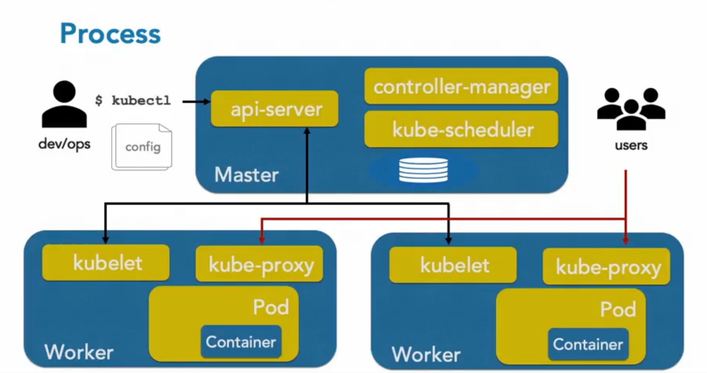

# Notes taken from LinkedIn Learning
Les notes ont été prises depuis [le cours "L'essentiel de Kubernetes".](https://www.linkedin.com/learning/l-essentiel-de-kubernetes/configurer-le-cluster-on-premise?originalSubdomain=fr)

## Introduction aux conteneurs

Arrivés avec l'ascenscion du dévelopement de micro-services, avec des cycles de mise en production court et  
avec une tendance scale out plutôt que scale up, les conteneurs deviennent incontournables.  
Il permet de lancer plusieurs services isolés les uns des autres sur un même host.  
  
**Les conteneurs sont arrivés avec :**  
- **FreeBSD jails**  
- **Solaris Zones**  
- **AIX WPARs**  
- **LXC** (linuxcontainer)  
- **Docker** (s'est imposé grâce à sa solution enterprise et le support qu'il a donc apporté aux entreprises)
- **OCI** (open container initiative, fait partie de la LinuxFoundation et porté par Docker et d'autres leaders de   
la conteneurisation.) 

On retrouve dans l'OCI des specificationss comme le runtime spec, qui spécifie le runtime qui permet d'exectuer  
le conteneur. Ou encore l'image spec, qui spécifie comment doit être composé une image de type conteneur.

## Docker ? c'est quoi ?

Docker c'est le leader mondial en terme de conteneurisation. Il est aussi le runtime par défaut utilisé par  
Kubernetes, lui aussi qui s'impose comme un leader mais dans l'orchestration de conteneur. Docker s'execute  
sous la forme d'un service/daemon appelé le docker engine. Et donc la machine qui execute du docker s'appelle  
un docker host. Cet host va executer des conteneurs qui sont des instances d'execution d'images qu'on récuperera  
depuis des registry. Pour accéder à l'engine on utilise la docker cli (sous windows interface web).  
L'image est un ensemble de layers, fourni par un éditeur ou vous-même.  
Le conteneur est l'instance en cours d'execution d'une image. L'image contient les libs/binaires.  
Les applications deviennent portables (multi hosts), facile à déployer/versionner avec git par exemple.  
  
## Intro historique & commerciale de kubernetes

Bon, maintenant y a énormément de conteneurs, mais du coup il nous faut un outil pour automatiser leur   
déploiement et toutes les actions requises à leur bon fonctionnement. Kube est donc un orechestrateur  
qui va amaner une fonction de cluster permettant de manager plusieurs docker host depuis une ligne de commande. 
Il va venir avec des fonctionnalités de **scalabilité, de load balancing & d'HA facilitées**.  
Kubernetes est un projet issue de google (Borg) et va être fourni à la CNCF (cloud native computing foundation).  
Cela sera le Premier projet de la fondation. (Première version en 2015.) 
  
Il va donc nous gérer les apps conteneurisées, le déploiement massif, le monitoring de lui-même, la montée   
en charge et le rolling update. (mise à jour à chaud sans down time). 
  
Kube va gérer la partie execution ainsi que la partie configuration de applications via des fichiers yaml. 
Cela facilite la gestion d'application sous différent environnements (test, dev, staging, pprod, prod)
Il va gérer aussi des secrets et des RBAC (role based access control). Les secrets permettant de chiffrer  
certaines configurations pour les applications qu'on ne voudrait pas divulguer à tous les utilisateurs du  
cluster.  

## Intro fonctionnelle de kubernetes 

Un **cluster kubernetes c'est quoi ?** Un ensemble de noeuds (linux ou windows) fournissant des services   
définies. Soit on a un cluster Linux, soit on a un cluster Windows.  
Un **cluster kubernetes ça execute quoi ?** Des pods, et non pas des conteneurs. Un pod contient 1 ou un  
ensemble de conteneur. Les conteneurs dans le même pod possèdent la même stack réseau & stockage.  
Un **déploiement Kubernetes ? qésaco ?** Un objet Kubernetes qui gère un pod ou des pods, de l'instancier à   
moulte reprise et même de le mettre à jour.  
C'est quoi un **service Kubernetes ?** C'est différent d'un service Docker, ne confondez pas. Sur Kubernetes, un  
service sert à exposer les ports d'un pod soit inter cluster, soit extra cluster (pour des clients par exemple).  

**Pour administrer** et/ou utiliser **kubernetes** on peut utiliser :  
- La CLI : [`kubectl`](https://github.com/kubernetes/kubectl)
- Le BUI (Browser User Interface) : [`kubernetes dashboard`](https://github.com/kubernetes/dashboard)

Au sein d'un cluster Kubernetes, il y a **2 différents type de Noeuds** :  
- les **masters** = aussi appelés Kubernetes Control Plane, se charge de la gestion du cluster, ils orechestrent et execute les pods. Ils exposent l'apiserver qui est le point d'entrée du cluster. Toutes commandes kubectl intérogent l'apiserver.  
- les **workers** = il execute des pods. Il fournit des ressources pour le cluster et reçoit ses infos par le master. Ce sont les workers qui exposent les applications aux users.  

## Architecture générale de kubernetes

## Les différents composants de Kubernetes  

Les composants des masters :  
- [kube-apiserver](https://kubernetes.io/docs/reference/command-line-tools-reference/kube-apiserver/) (point d'entrée du cluster, moyen de communication avec les [kubelet](https://kubernetes.io/docs/reference/command-line-tools-reference/kubelet/))
- [kube-scheduler](https://kubernetes.io/docs/reference/command-line-tools-reference/kube-scheduler/) (orchestrateur, répartition de charges, choix du worker adapté au pod à exécuter celon les specs...)
- [kube-controller-manager](https://kubernetes.io/docs/reference/command-line-tools-reference/kube-controller-manager/) (contient un ensemble de controller, pour controler le nombre de réplicas, les accès...) 
- [etcd](https://kubernetes.io/fr/docs/concepts/overview/components/#etcd) (base de donnée (clé/valeur) contenant les états du cluster, les infos des objets déployés, et toutes les activités au sein du cluster.)
  
Les composants des workers :
- [kubelet](https://kubernetes.io/docs/reference/command-line-tools-reference/kubelet/) (Composant qui permet de communiquer avec les masters via l'apiserver. Il doit s'assurer que les pods s'exec comme il le devrait suivant les specs.)
- [kube-proxy](https://kubernetes.io/docs/reference/command-line-tools-reference/kube-proxy/) (Gère la partie réseau et l'exposition des ports, c'est la barrière entre les utilisateurs et les pods.)
  
## Les ressources Kubernetes  
  
Il existe plusieurs catégories de ressources. Celles qui vont gérer les applications, celles qui vont gérer  
la partie Load Balancing (), celles qui vont configurer les applications, celles qui vont gérer la partie  
stockage et enfin les ressources qui gèrent la configuration même du cluster.  
  
* Ressources de **gestion d'applications** :
  - **Pod** : exécute l'application dans un conteneur
  - **Deployment** : défini comment on va déployer le pod et comment on va controler celui-ci
  - **ReplicaSet** : défini l'ensemble de réplicas d'un pod. C'est avant tout un controller qui doit maintenir l'état d'un pod suivant ses specs.  
  - *Example* > Au final on va avoir un déploiement qui va lancer un ReplicaSet et qui va surveiller un   
ensemble de replicas d'un pod.  
* Ressources de **gestion du LoadBalancing et du réseau** :
  - **Service** : Gère l'accès au pod soit à l'intérieur du cluster soit à l'extérieur de celui-ci.
  - **Add-on réseau** : Ce qu'on va installer pour gérer le cluster niveau réseau. 
* Ressources de **gestion de la configuration des applications** :
  - **Configmap** : Gère les configurations des applications  
  - **Secret** : Gère les credentials nécessaires pour les applications
* Ressources de **gestion du stockage** :  
  - **Persistent Volume (PV)** : Permet de créer des volumes qui sont extérieurs au container donc au pod, et qui ont un cycle de vie indépendant.  
  - **Volume Claim** : Opération de demande de PV entre taille, utilisation etc...

## L'essentiel de Kubernetes

On install kubeadm, on `kubeadm config images pull` pour récupérer les images
docker servant à provisionner dans pods les composants faisant fonctionner kubernetes.

- l'apiserver
- le scheduler
- le controller manager
- le kube proxy
- etcd
- et coredns

Puis on check quel `CNI` (solution de gestion du réseau dans kube) on utilise avant d'initialiser  
le cluster via la commande :  
`kubeadm init --apiserver-advertise-address=X.X.X.X --pod-network-cidr=X.X.X.X/16` (pour le CNI calico)

Ensuite on va devoir sur le master adapter le fichier de configuration de kubernetes pour utiliser la  
commande `kubectl`. 
- mkdir -p $HOME/.kube
- sudo cp -i /etc/kubernetes/admin.conf $HOME/.kube/config
- sudo chown $(id -u):$(id -g) $HOME/.kube/config

Maintenant on peut ajouter des pods dans le cluster kubernetes. Sachant qu'un pod est une entité managé  
par kubernetes qui représente 1 ou plusieurs conteneurs. C'est la plus petites ressources kubernetes.  

Donc on va pouvoir lancer le pod qui sera notre CNI et qui représentera la gestion du réseau au sein de  
notre cluster : `kubectl apply -f https://docs.projectcalico.org/v3.8/manifests/calico.yaml`
Pour vérifier que tout est ok : 
- `kubectl get nodes`
- `kubectl get pods | grep calico`

Ensuite si on veut rajouter dans le cluster un worker on aura juste à taper la commande `kubeadm join` qui  
nous a été donné en standard output lors de la création du master. Cela devra ressembler à quelque chose du  
style : (sur le worker évidemment)    
`kubeadm join X.X.X.X(master):6443 --token XHHEGFJHZKDBCZDJH --discovery-token-ca-cert-hash sha256:rjkergç9EJEhffje9`

On verifie avec `kubectl get no`  

## Context

Le Context défini le cluster kubernetes cible, l'utilisateur pour se connecter au cluster avec  
ses credentials et son namespace par défaut. 

Lister les context disponible dans notre kubeconfig :  
`kubectl config get-contexts`  

Par défaut pour que la commande sache quel context elle utilise un fichier à l'emplacement  
~/.kube/config (sous Linux) mais on peut changer l'emplacement en manipulant la variable d'environnement  
$KUBECONFIG. On peut donc avoir plusieurs configurations et jongler avec elles en changeant l'emplacement.  
On peut aussi spécifier à la ligne de commande `kubectl` l'argument `--kubeconfig`.  

Pour changer de context :  
`kubectl config use-context foo`
  
Pour visualiser la configuration du context actuel :  
`kubectl config view`  
  
Pour supprimer un context :  
`kubectl config delete-context foo`  

Ajouter un nouveau context depuis un autre fichier :  
`scp root@ip_master:/etc/kubernetes/admin.conf ~/.kube/`  
`export KUBECONFIG=~/.kube/config:~/.kube/admin.conf`

